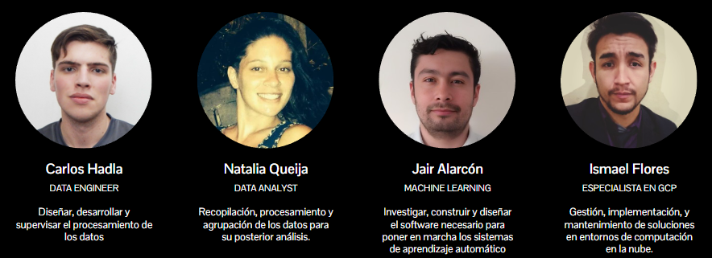

# NewYorkDrive - Transporte Sostenible

## Contexto
.

La empresa "NewYorkDrive" busca expandirse al transporte de pasajeros con automóviles, explorando la viabilidad de incorporar vehículos eléctricos para reducir la contaminación y mejorar la calidad del aire y sonido en la ciudad de Nueva York.

Este proyecto tiene como objetivo respaldar la toma de decisiones de "NewYorkDrive", para implementar una nueva línea de transporte. Se llevará a cabo una investigación exhaustiva, utilizando datos de alta calidad para analizar las características fundamentales que influirán en estas decisiones.

## Tabla de Contenidos

- [Equipo de Trabajo](https://github.com/IsmaDeveloper16/Proyecto-final#Equipo-de-Trabajo)
- [Metodología de Trabajo](https://github.com/IsmaDeveloper16/Proyecto-final#Metodología-de-Trabajo)
- [Alcance](https://github.com/IsmaDeveloper16/Proyecto-final#Alcance)
- [Stack Tecnológico](https://github.com/IsmaDeveloper16/Proyecto-final#Stack-Tecnológico)
- [Diagrama de entidad - relación](https://github.com/IsmaDeveloper16/Proyecto-final#Diagrama-de-entidad---relación)
- [Dashboard](https://github.com/IsmaDeveloper16/Proyecto-final#Dashboard)
- [KPIs](https://github.com/IsmaDeveloper16/Proyecto-final#KPIs)
- [Conclusión](https://github.com/IsmaDeveloper16/Proyecto-final#Conclusión)

## Equipo de Trabajo

## Metodología de Trabajo

Hemos adoptado la metodología ágil "Scrum", utilizando herramientas como Trello para la gestión de tareas. Esta metodología nos permite abordar complejidades con iteraciones cortas y entregas incrementales, fomentando la flexibilidad, la adaptación constante y la colaboración entre equipos.

- Semana 1: Esta etapa constituye la puesta en marcha del proyecto y el tratamiento de los datos. Se trazan los objetivos, los alcances del proyecto así como los KPIs a evaluar. Además, de realizar el EDA preliminar en los datos.
    
- Semana 2: Etapa de Data Engineering. Se crea, se implementa y se automatiza el datawarehouse. Además, se plantean los MVPs del dashboard y de los modelos de Machine Learning preliminares.
    
- Semana 3: Etapa final. Se completa principalmente el dashboard y se presenta el producto de Machine Learning. Además de realizar la entrega de la documentación y del repositorio completo.

## Alcance

- Introducir una flota de vehículos eléctricos considerando aspectos de energías alternativas, impacto ambiental y rentabilidad.
- Cumplir con acuerdos para reducir la huella de carbono y generar un impacto positivo en la comunidad.

## Stack Tecnológico

- **Google Colab**
- **Python**
- **Google Cloud Platform (GCP)**
    - Cloud Function
    - Google Cloud Scheduler
    - Google Cloud Storage
    - BigQuery
- **Power BI**
- **Vertex AI**

## Diagrama de entidad - relación

A continuación se presenta el diagrama entidad - relación del modelo presente en nuestro datawarehouse, Big Query.

## Dashboard
El dashboard a continuación, resume los resultados clave obtenidos durante el proyecto de implementación de vehículos eléctricos en la flota de transporte de "NewYorkDrive". 

Se realizaron 5 hojas:
- “Estadísticas”, donde se visualizan las estadísticas generales del negocio de los últimos 10 años
- “ROI”, en donde se analiza el retorno de la inversión de forma comparativa entre los autos a combustión y los autos eléctricos. Para ambos casos, se predijeron las ganancias netas con el modelo de Machine Learning y se calcularon los costos de inversión y combustible según los datos obtenidos.
- “Eficiencia en Rutas”, gracias a distintos gráficos se evalúan los tiempo promedio de los viajes, las distancias recorridas, y analizar como podríamos mejorar la eficiencia de las rutas gracias a distintas aplicaciones.
- “Costos de Combustible”, se analiza la diferencia en los costos de carga de un auto a combustible a diferencia de los autos eléctricos. Reflejando claramente una disminución en los costos de combustible si pasamos la flota a eléctricos.
- “Reducción de emisiones”, donde analizamos tanto los gases emitidos por los autos tanto como la contaminación sonora en la ciudad. 

Podés encontrar el dashboard final en el siguiente link: [dashboard-taxis-NY](https://drive.google.com/file/d/1pT3l3fyY6wDz4gvg4WQEiNGCzplDuKW6/view?usp=sharing)

## KPIs

Entre los KPIs que seguimos se encuentran:

- Retorno de inversión (ROI) esperado.
    - El retorno esperado por la implementación de vehículos eléctricos va a ser de un 20% luego del período de 6 años.

- Reducción de emisión de carbono.
    - La Reducción de Emisiones es un indicador clave de rendimiento que evalúa la efectividad de las medidas adoptadas para reducir las emisiones generadas por los vehículos de combustión.

- Eficiencia de las rutas.
    - Nos enfocamos en evaluar la eficiencia de las rutas de los taxis, con el objetivo de optimizar la distancia promedio recorrida por cada viaje.

## Conclusión

Este proyecto representa un paso significativo hacia la transformación del sistema de transporte, al buscar implementar una solución más sostenible y eficiente. Se ha llevado a cabo un análisis exhaustivo respaldado por un equipo multidisciplinario con un enfoque colaborativo y una metodología ágil.

El proyecto comenzó identificando la problemática: la necesidad de expandir el servicio de transporte de pasajeros hacia vehículos más sostenibles. La introducción planteó la visión de la empresa de alinearse con tendencias de mercado y prácticas sostenibles. El equipo de trabajo, conformado por expertos en datos, ingeniería y aprendizaje automático, se ha centrado en la selección y uso de tecnologías adecuadas para abordar esta problemática.

La vida del dato ha sido fundamental, desde la obtención a través de técnicas como web scraping y acceso a APIs, hasta el Análisis Exploratorio detallado, para comprender la estructura y la calidad de los datos. La automatización de procesos mediante Cloud Functions y Cloud Scheduler ha asegurado una gestión eficiente y organizada de datos en BigQuery, sentando así las bases para futuros análisis y modelos de Machine Learning.

Este proyecto representa un esfuerzo integral para desarrollar un sistema de transporte más sostenible y eficiente. El enfoque colaborativo, la cuidadosa gestión de datos, el análisis profundo y la definición de KPIs nos han guiado hacia una toma de decisiones informada y estratégica en pos de un futuro más sostenible en el transporte de pasajeros.

